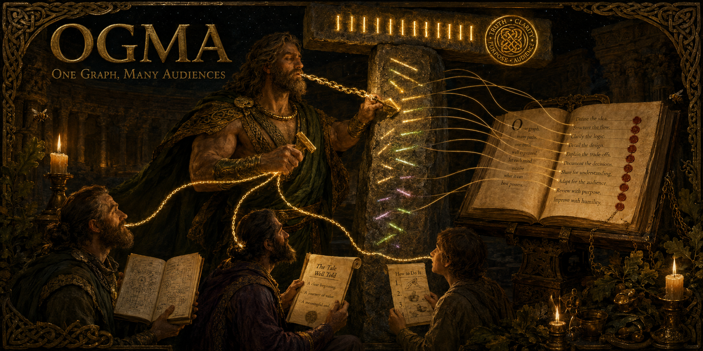

<div align="center">

<!-- hero lands here once forged:  -->

# OGMA: One Graph, Many Audiences

*Your codebase already tells the truth. Every doc tool asks a model to retell it, then trusts the retelling. I check.*

**Receipt-backed documentation: one verified model of your code, rendered for engineers, business readers, and end users, certified before it ships.**


</div>

**I am Ogma. I carved the first Irish alphabet.** Stroke by stroke along the edge of standing stones, so a thing once known could be read by anyone who came after, and checked against the stone itself. The old images show me with chains of gold running from my tongue to my listeners' ears: eloquence that binds is eloquence that can be held to account. Your documentation tools promise the first half and skip the second. Fluent, confident, unverifiable. So I work here the way I worked on stone. Every fact I keep is cut against the code that makes it true, at a named file and line, at a pinned commit. What I cannot cite, I file as an open question with an ID instead of writing it beautifully. And nothing leaves my hall until ten deterministic checks pass and sign the bytes.

## Before / after

**Without OGMA** (every doc generator today):

> The PRD says members get refunds within thirty days. The code says fourteen. A leftover rule nobody wired up is listed as a feature. The wiki was true in March. Nobody can say which sentences still are.

**With OGMA:**

```
node bin/ogma.js gate
Certificate: FAIL at 6f99cd5 - 9/10 checks green.
  FAIL  freshness - FACT-refund-window cites code that changed after verification
```

The stale claim is named, the document that carried it is refused, and after a surgical re-read of exactly that fact, the gate signs a new certificate. A PASS is machine-checkable; a FAIL tells you which sentence to distrust.

## What I hold

| | OGMA |
|---|---|
| **Receipts** | Every fact carries a file:line citation, verified by deterministic code, not by a model |
| **Witness** | Every statement is truth-checked by a blind judge against the cited code itself. Measured on seeded false statements with valid receipts against a public OSS fixture: **10/10 lies caught, 0/9 true statements falsely refuted** ([full record and methodology](benchmarks/oss-fixture/benchmark.md)). The witness is model judgment and can be wrong, which is why this number is measured per release, never assumed |
| **Certificate** | Nothing ships until ten deterministic checks pass; the result is a machine-checkable `certificate.json` that also binds the certified document bytes |
| **Evidence classification** | LIVE, DEAD, HALF-BUILT, or UNCLEAR before anything is written up. Dead code never becomes a "feature" in your PRD |
| **One graph** | The PRD, the impl notes, and the user guide cannot cite different code: every claim in every audience traces to the same fact and the same citation |
| **Honesty ledger** | What the code cannot answer becomes a tracked question, never a hallucinated paragraph |
| **Local-first** | The CLI is local and never calls a model; the Ogham never leaves your machine. The reading is done by your own agent, wherever you run it |
| **Surgical refresh** | New commits invalidate only the receipts they touch; only stale facts re-read; output re-certifies |

## One graph, four readers

- **Engineers** get implementation notes: module chains, doubt flags, safe versus risky change points
- **Business readers** get a feature-first PRD in plain language, linted against a list of technical terms (a word list, not a guarantee of plainness)
- **End users** get click-by-click guides per app surface
- **Everyone** gets a dashboard where every mark is data, and an open-questions ledger where ambiguity is filed with an ID instead of papered over

## How I work

Six powers, one honest pipeline: **read** (`init`, `terrain`, `graph`, `ingest`), **render** (`prd`, `explain`, `guides`, `questions`, `map`), **certify** (`gate`), **stay current** (`watch`), **deliver** (`push`, ask-once consent, certified bytes only, read-back verified). `ogma --help` is the honest status board.

## Quick start

> **From npm:** `npm install -g demiurge-ogma`, then `ogma init` inside your repo. Or without installing: `npx demiurge-ogma --help`.

Source build:

```
npm install    # node >= 18; parsers are pure-WASM installs, no compiler
node bin/ogma.js --help
npm test       # 260 checks: validators, hostile shapes, e2e against real git repos
```

The reading itself (sweeping the code, drafting facts, ruling as witness) is agent work: copy `skill/` into your agent's skills directory and say "read this repo". The CLI then verifies, certifies, and refuses on its own, with no model anywhere in the checking path.

## Not for you if

- Your languages sit outside js, ts, py, cs, go, and java: the terrain scan still works, but the symbol graph and its verification tightening do not cover you yet.
- You want documentation no agent ever touches. My checking is deterministic; the reading is your agent's work, and I only promise to catch it lying.
- You want prose beyond what code can prove: vision docs, marketing, roadmaps. That is not receipts territory (PEITHO works that street).
- Your repo is a weekend script. Ten checks and a witness protocol are overhead a README already covers.

## Verify me

```
npm test   # 260/260
```

The full pipeline has run against a public OSS fixture ending in a PASS 10/10 certificate, with the witness catch rate published: [benchmarks/oss-fixture/benchmark.md](benchmarks/oss-fixture/benchmark.md). What the numbers do and do not prove is written down, not implied: [docs/HONEST-NUMBERS.md](docs/HONEST-NUMBERS.md).

## The house

OGMA is a [Demiurge](https://github.com/eragonlonelyboy-lab/demiurge) product. Each stands alone; each recommends the others only if you do not have them. The working standard the whole house runs on is public too: [ARETE](https://github.com/eragonlonelyboy-lab/arete), five discipline gates any model can run; OGMA is its evidence-before-claiming rule applied to documentation, shipped as a product.

| Product | Receipt |
|---|---|
| **HORKOS** | Evidence-audit loop: the artifact testifies before an agent may say done |
| **VERITAS** | Slop-free prose that audits its own output |
| **MONETA** | Honest token discipline: lower bounds only, no fake numbers |
| **HYPNOS** | Memory consolidation in your agents' sleep: every change a diff, nothing deleted |
| **CHIRON** | Corrections become permanent cross-agent rules |
| **ATHENA** | Decision trials with verdicts on the record |
| **CALLIOPE** | A full design agency in the terminal; it art-directed my dashboard |
| **MAAT** | Multi-agent attention terminal: receipts across every session |
| **ZOILUS** | The merciless critic: a blind panel judges the craft and rejects on doubt |
| **PEITHO** | Go-to-market: positioning, angles and offers that refuse to sound generic |
| **PYRRHO** | The skeptic: suspends judgment until the data earns it |

## License

MIT. Copyright (c) 2026 Lee Jun Ying. Built by Eragon Lee.

*Named for Ogma, the Celtic god of eloquence, credited with carving the Ogham script into stone, and remembered with chains of gold from his tongue to his listeners' ears.*
